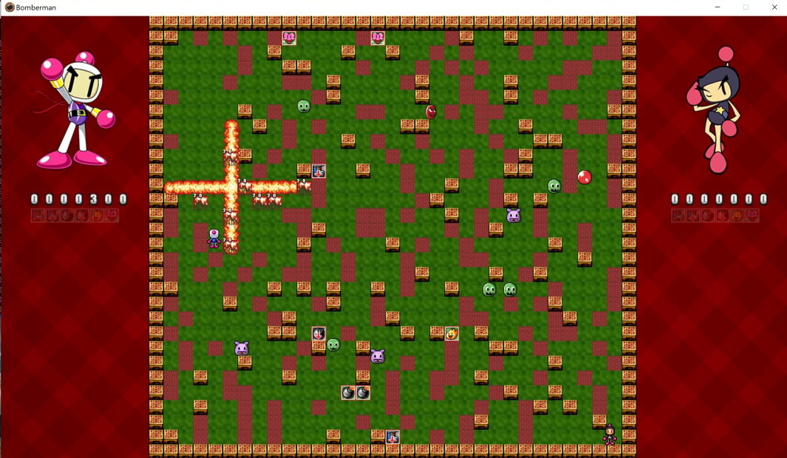

# Bomberman 2D

About the game
===========
Bomberman 2D is a videogame developed entirely in C#, using a small game engine developed during the first year at AIV. I developed it as a personal project using game programming techniques acquired during my first year at the Academy. Each time the game is started, everything is created randomly, while only the positions of the players are fixed.
